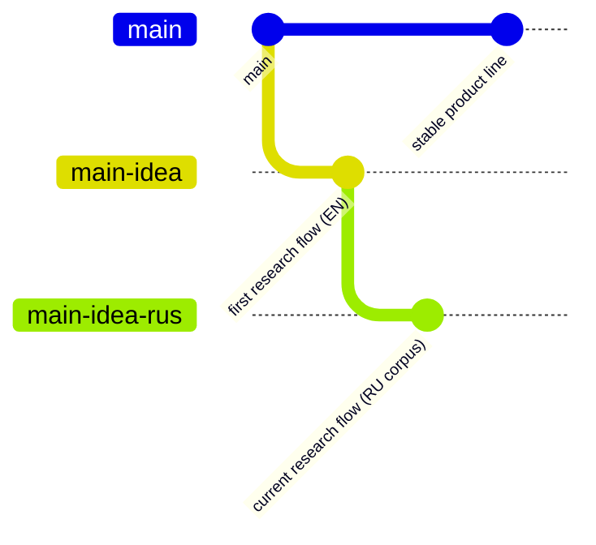

# fast_read

`fast_read` is a controlled reading research app.
It compares two formats on the same fixed Russian-language corpus:
- one-word-at-a-time playback,
- normal PDF page reading.

This repository is primarily used to run a structured study protocol and collect session data.

## Why Use It
- Run a deterministic research flow (same order for every participant).
- Measure hidden reading time per segment.
- Collect calibration, familiarity checklist, and mandatory feedback in one JSON record.
- Compare `words` vs `pdf` format performance across the same 6 texts.

## Branch Graph


- `main`: ready product branch where users can upload PDF and read by letters.
- `main-idea`: first research implementation in English.
- `main-idea-rus`: current primary branch for research data collection.

## Features (main-idea-rus)
- Required participant name at start.
- Calibration from `pdf_start.pdf` with manual WPM controls (`50..700`).
- Exactly 6 texts and 12 measured segments in locked alternating order.
- One-word mode tokenization by whitespace and punctuation.
- Hidden timing per segment (never shown to participant).
- Mandatory familiarity checklist before mandatory free-text feedback.
- Session persistence to JSON in `data/sessions/`.

## Installation
```bash
python3 -m venv .venv
source .venv/bin/activate
pip install -r requirements.txt
```

## Quickstart
```bash
python3 app.py
```

Open: `http://127.0.0.1:5000`

## Common Branch Workflows
Run current research branch:
```bash
git checkout main-idea-rus
python3 app.py
```

Run stable product branch:
```bash
git checkout main
python3 app.py
```

## Contributing
- Open an issue or PR with a clear scope.
- Keep docs in sync with meaningful behavior changes.
- Create a local commit for each meaningful change.

## License
This project is licensed for **non-commercial use only** under:
- **Creative Commons Attribution-NonCommercial 4.0 International (CC BY-NC 4.0)**.

See [LICENSE](LICENSE) for details.
